<div align="center">

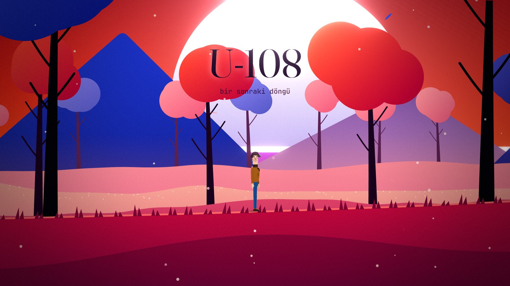

# U-108 Remake

### *bir sonraki döngü* · the next loop

**A first game, made at a bootcamp in 2023, rebuilt from nothing three years later.<br />
It starts exactly as it was. Then it remembers what year it is.**

[](#building)
[](#technology)
[](#architecture)
[](#architecture)
[](#decisions-worth-reading)
[](#the-game-is-in-turkish)
[](CHANGELOG.md)
[](LICENSE)

[](https://github.com/OzcanOrhanDemirci/U-108)
[](#the-story)

[The story](#the-story) · [Then and now](#then-and-now) · [Playing](#playing) · [How it was made](#how-it-was-made) · [Architecture](#architecture) · [What is verified](#what-is-verified) · [Building](#building) · [Privacy](#what-the-game-reads-and-writes) · [Credits](#credits-and-licences)

*[Türkçe](README.tr.md)*

</div>

---

In the summer of 2023, a team of four on the Oyun ve Uygulama Akademisi bootcamp made a short Unity
platformer called **Bootcamp Projesinden Kaçış**, *Escape from the Bootcamp Project*. Its hero knows
he is inside a game and wants to get back to the real world. It was the first piece of software its
Scrum Master, Özcan, ever finished. Its last line was a promise:

> *"Oyun kapanıp açılınca her şey baştan başlayacak."*
>
> When the game closes and opens again, everything will start over.

This repository is that next opening. The remake begins as the 2023 game, with the menu, the
dialogue and the first level reproduced one to one from the shipped build. Then it breaks, and keeps
going: five new worlds, a character who has been waiting since 18 July 2023 at 06:50, and a voice
that did not exist in 2023.

| Kızıl Orman · *the crimson forest* | Karanlık · *the dark* | Sonbahar · *autumn* |
| --- | --- | --- |
| 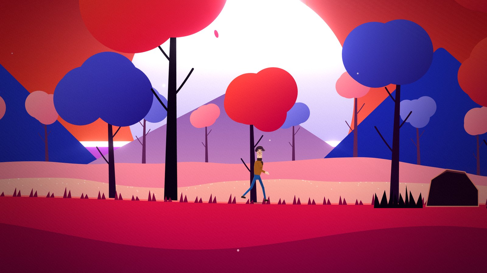 | 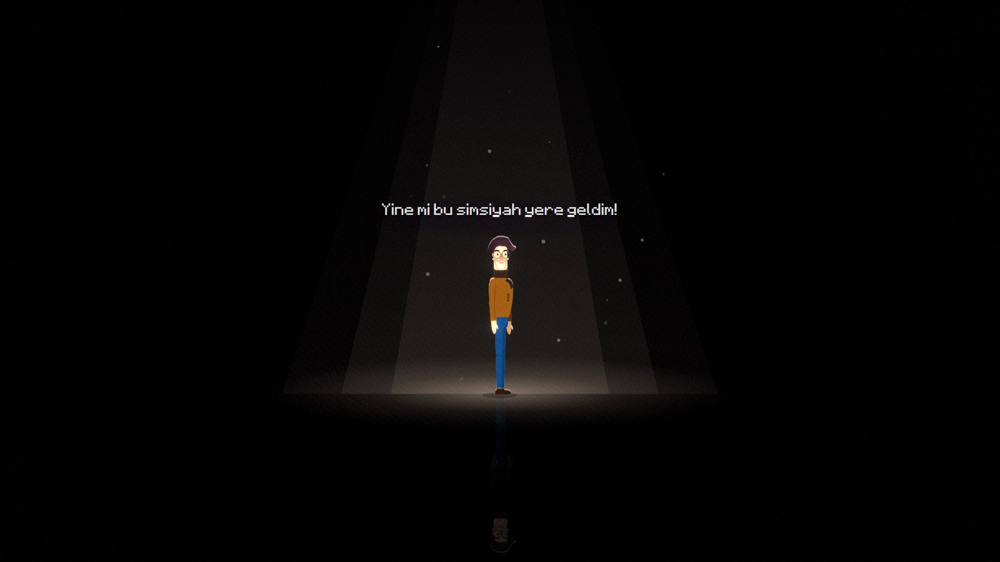 | 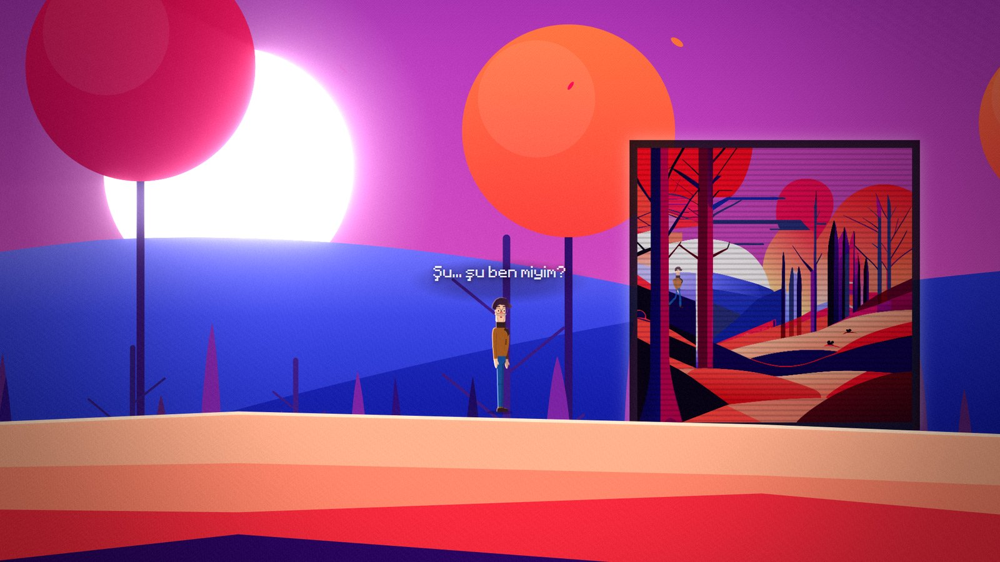 |
| *Walk, jump, and the forest keeps rising behind you.* | *"Yine mi bu simsiyah yere geldim!" The 2023 line, still there.* | *"Şu... şu ben miyim?" Is that... is that me?* |

| Laboratuvar · *the laboratory* | Gün batımı · *sunset* |
| --- | --- |
| 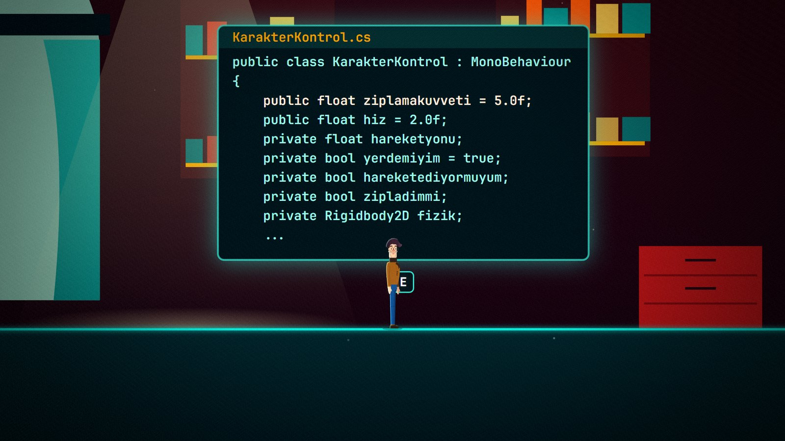 | 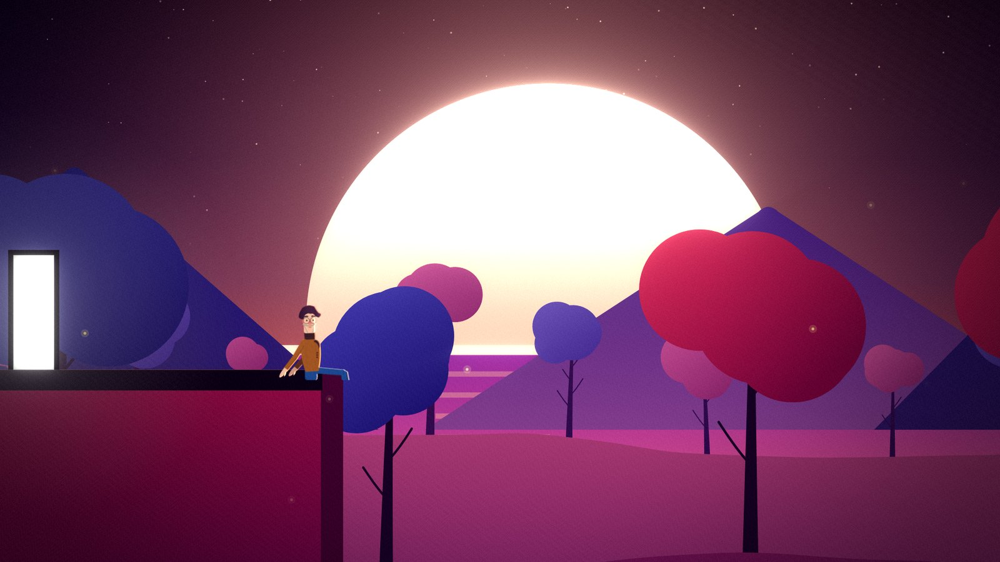 |
| *The real 2023 `KarakterKontrol.cs`, on the wall of the world it ran.* | *The end of the loop, or the start of the next one.* |

### The game is in Turkish

Every line of dialogue is Turkish, including the 2023 lines it preserves. This page is in English
and [Turkish](README.tr.md); the game itself has no translation, by choice. It is a story about one
particular project, in the language it was written in.

## The story

The 2023 game was built in three sprints with Unity 2022.3 by **Team Unity 108**: a menu, three
dialogue scenes, two short levels, a laboratory and a credits screen. The character was drawn by
hand, walked in four frames and talked in Minecraftia. The build is dated **18 July 2023, 06:50**.
The original repository, with the team, the sprint notes and the 2023 assets, is
[OzcanOrhanDemirci/U-108](https://github.com/OzcanOrhanDemirci/U-108).

Three years later Özcan had become a software developer. He put the old project folder on his
desktop and asked for it to be made into something worthy of it.

> *"Bugün onlarca yazılımım var, yayında uygulamam var. Yazılımcı oldum ama bu ilk projem."*
>
> Today I have dozens of programs, and apps in the stores. I became a software developer, but this
> is my first project.

Respect, he said, did not mean leaving it unchanged. It meant keeping the main idea and the feeling
of 2023, so that whatever came out would feel like the same game, or its continuation. Everything
else was free, including the dialogue, and including the fourth wall. And there was a second reason:

> *"2023'te yapay zekâ geliyor deniyordu, diyalogları kendim uğraşıp yazmıştım. Şimdi karşımda zeki
> olduğunu iddia eden bir makine var ve o kendi diyaloglarını yazıyor."*
>
> In 2023 people were saying AI was coming, and I wrote the dialogue myself. Now there is a machine in
> front of me that claims to be intelligent, and it writes its own dialogue.

So the remake is also a test: what an AI makes when it is handed someone's first game and told to
surprise him. The answer is in the game. The design notes are below, folded, because they spoil it.

## Then and now

| 2023 | 2026 |
| --- | --- |
| 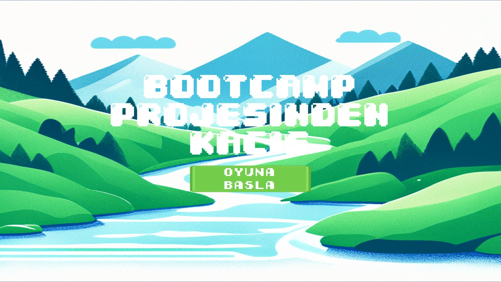 |  |
| 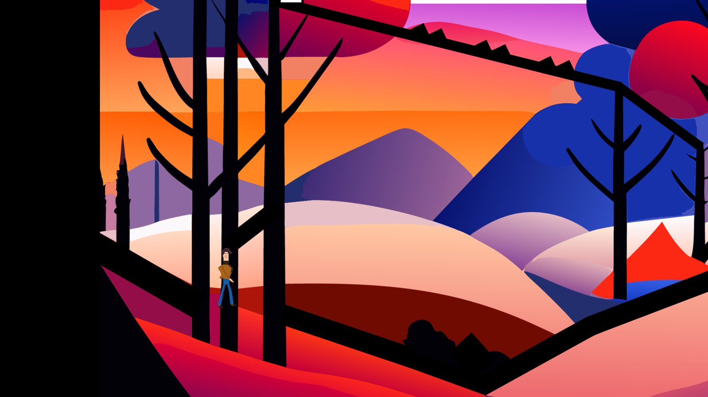 | 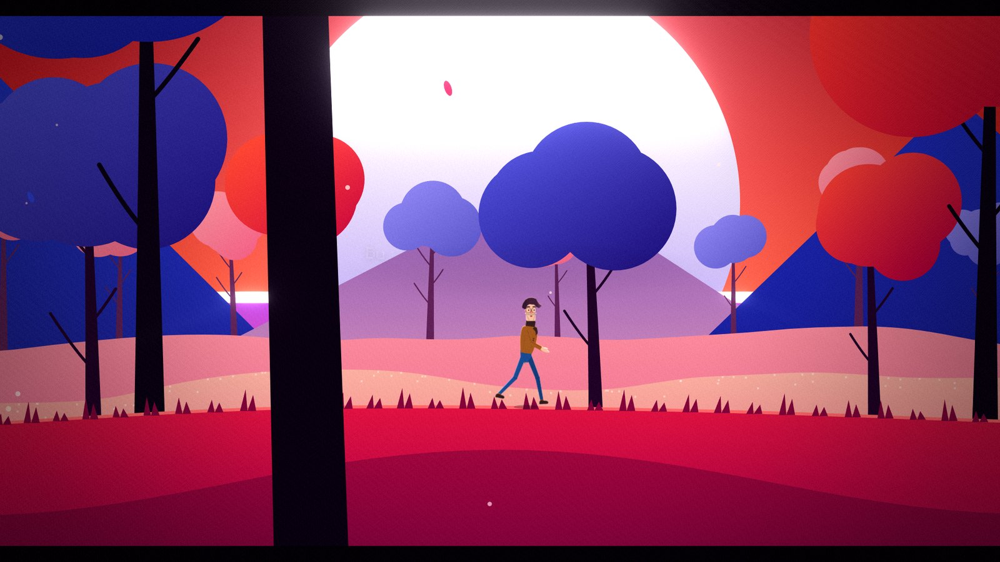 |

The 2023 screens above are not photographs of the old game: they are the remake running its 2023
mode, which reproduces the original from data read out of the build.

<div align="center">
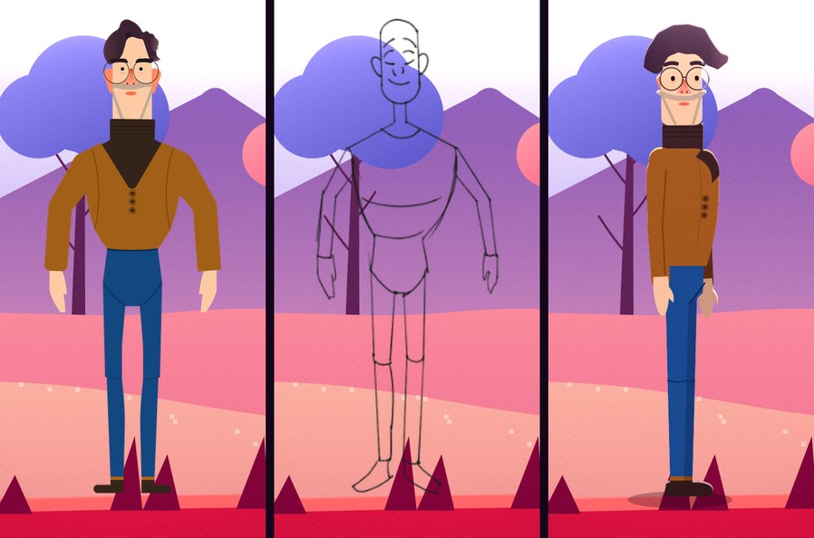
<br />
<sub>2023 sprite · 2023 pencil sketch · 2026, drawn in code. The game shows this transformation.</sub>
</div>
<br />

| | 2023 | 2026 |
| --- | --- | --- |
| Engine | Unity 2022.3.4f1 | None. TypeScript, Canvas 2D and WebGL2, in a .NET 10 shell |
| Character | Hand-drawn sprites, a four-frame walk at 12 fps | A rigged puppet drawn in code, proportions and colours measured from the 2023 sprites |
| Opening | Menu, dialogue, first level | The same, one to one: physics, text speed and layout read from the build |
| Worlds | Two levels, a laboratory | Five: the crimson forest, the dark, autumn, the laboratory, the sunset |
| Music | One piano piece, F minor, about 52 BPM | The same recording, and a procedural felt piano in its key |
| Dialogue | Written by Özcan | Written by an AI; the 2023 lines are kept where they appear |
| Memory | None. Every launch starts over | It remembers you, between sessions, across versions |

## Playing

Packaged builds are attached to [Releases](https://github.com/OzcanOrhanDemirci/U-108-Remake/releases):
unpack, keep `U-108.exe` next to its `oyun` folder, and run it. To build it yourself, see
[Building](#building).

| | Keyboard | Gamepad |
| --- | --- | --- |
| Walk | A / D or ← / → | Left stick or d-pad |
| Jump | Space, W or ↑ | A |
| Interact | E or Enter | X |
| Continue | Space, Enter, E or a click | A |
| Pause | Esc | Start |
| Window or full screen | F11 | |

In the 2023 parts the 2023 controls apply, as they did then: **A** and **D** to walk, **W** to jump,
and the mouse for the *Devam et* button.

The game is short; an automated run from the first menu to the ending takes about eleven minutes, and
a person reading every line takes longer. It saves by itself. Closing it is allowed, and so is coming
back: it notices both.

## How it was made

The remake was written by **Claude**, Anthropic's AI model, working in
[Claude Code](https://claude.com/claude-code) on Özcan's computer over two days in October 2026.
Özcan set the brief, played the builds and reported what he found. Claude wrote the code, the
scenes, the music and the dialogue, and tested its own work. The 2023 project folder was treated as
read-only from the first minute to the last.

### Reading 2023 from the build, not from memory

The original game exists as a compiled Unity build, so its numbers were read out of the build files
with [UnityPy](https://github.com/K0lb3/UnityPy) and a type-tree generator rather than estimated
from screenshots:

- **Physics.** `ziplamakuvveti` (jump force) is 5 in the scene, although the script says 2, and
  `hiz` (speed) is 2, not 1. Gravity scale 1, so 9.81. A capsule of 13.94 × 37.65 at a scale of
  0.04, zero friction under a name the team gave it, `PlatformColliderBugFix`, a fixed step of
  50 Hz, and the camera a child of the character at an offset of (3.2, 2.0).
- **Text.** The typewriter prints one letter every 0.1 s and waits an extra second after a full
  stop. The dialogue box, its 24 px Minecraftia lines, and the *Devam et* button at (1799, 994) in a
  1920 × 1080 canvas.
- **Time.** The executable was last written on 18 July 2023 at 06:50:16. The game counts the days
  from there.

The results are in [`docs/ORIJINAL.md`](docs/ORIJINAL.md). With these values, a search over every
input sequence confirmed that both 2023 levels can still be finished by the reproduced controller,
the way they could in 2023.

### Bugs became scenes

After 1.0.0 Özcan played the remake and found four mistakes over two rounds: rocks too slanted to
stand on, a head that trailed behind the neck while running, a spelling mistake, and two pianos
playing at once after a restart. He asked for the fixes to become part of the story. They did: a
player who has finished the game and opens a newer version meets a character who notices that his
world was patched. What changed is in the [changelog](CHANGELOG.md).

## Architecture

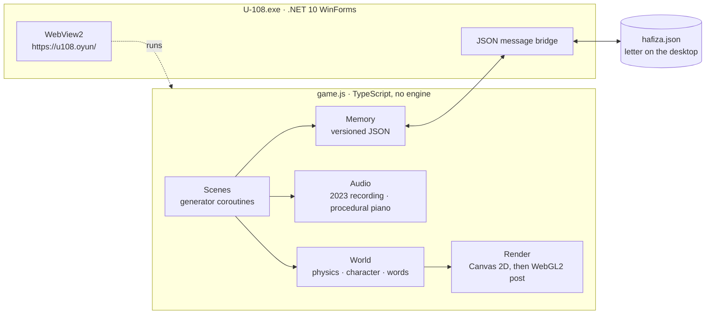

The game is a single bundled script that runs in WebView2 inside a small WinForms shell. The shell
maps the game folder to a virtual origin, `https://u108.oyun/`, so nothing is served over a network,
and answers a handful of JSON messages from the game: read and write the memory file, write the
letter, set the window title, go full screen, close.

```text
src/
  core/      audio, procedural music, input, coroutines, maths, asset loading
  world/     physics, the character puppet, particles, word platforms, the stage base class
  render/    vector art helpers and the WebGL2 post-processing pass
  scenes/    2023 menu, dialogue and levels; the break; forest, dark, autumn, laboratory, sunset, visit
  story/     2023 text and level geometry, version, letter, story variables
  ui/        the three voices, pause menu, name entry, code panels, text layout
  meta/      host bridge and memory
host/        the WinForms and WebView2 shell (Program.cs)
public/      index.html and assets: 2023 sprites, audio, typefaces
tools/       build, package, screenshot harness and test scenarios
docs/        design notes (spoilers), data read from the 2023 build, status log, images
```

### Decisions worth reading

- **No engine.** Every pixel on screen is drawn by code in this repository: vector scenes in
  Canvas 2D, then a WebGL2 pass for bloom, god rays, grain and the glitch. Reproducing the 2023 game
  one to one meant owning every number, and a game about a project escaping its engine should not
  sit inside another one.
- **Two controllers, two kinds of physics.** `Controller2023` reproduces the 2023 `KarakterKontrol.cs`
  line for line: 50 Hz, direction locked in the air, grounded the moment it touches a `Platform`.
  The 2023 levels are only fair if they are exactly as hard as they were. The new controller uses
  separating-axis collision with a capsule, and solves terrain as a height field so the body never
  catches on the seam between two segments. Words written into the world are one-way platforms.
- **A character from measurements.** The new character is a puppet with hips, lean, neck, head and
  arms, drawn every frame. Its proportions and colours were measured in pixels from the 2023 sprites,
  so that the new body is recognisably the old one.
- **Light that keeps colour.** The bloom's bright pass uses luminance. A max-channel threshold, tried
  first, made every saturated red count as a light source and washed the forest out.
- **Scripts as generators.** Each scene's script is a generator coroutine built from `wait`, `tween`
  and `all`. Conversations go through a queue, so lines triggered by the player never overlap, and an
  urgent scene can interrupt a running one.
- **Sound that does not pile up.** The 2023 recording is played as it was; around it a procedural
  felt piano and pads play in F minor and A♭ major, the key of the 2023 piece. Every looping track
  keeps a handle that is stopped on exit, and the music bus keeps a registry a test can count. Both
  came from the 1.0.2 bug.
- **Memory as part of the story.** A small versioned JSON file. The game knows how long you have been
  away, what you named the character, and which version of his world he last lived in.
- **A shell that can test itself.** With `U108_TEST=1` the packaged application opens off screen,
  muted and without taking focus, exercises the bridge, takes a picture and closes, writing its
  results to `%TEMP%\u108_test` instead of the real memory and desktop.

## What is verified

```bash
npm run typecheck

# the bot plays from the 2023 menu to the ending
node tools/shot.mjs --url "?sahne=menu2023&sifirla=1" --script tools/senaryolar/bot.mjs --out shots/bot/b.png

# the 2023 levels are still completable under the reproduced physics
node tools/shot.mjs --url "?sahne=menu2023" --script tools/senaryolar/plan2023.mjs --bolum 1

# after "Baştan başla" exactly one piano plays
node tools/shot.mjs --url "?sahne=ziyaret&bitmis=1&sifirla=1" --script tools/senaryolar/muzik102.mjs --out shots/m/a.png --secim bastan
```

The screenshot harness drives the game in headless Chromium with a fixed step of 1/60 s, so every
run of a scenario sees the same frames.

- **The whole game, end to end.** A bot plays from the 2023 menu to the ending without a single
  death. The game closes itself, and the letter and the memory it leaves are checked, including a
  name typed with Turkish letters.
- **2023 is still winnable.** A search over input sequences, each a tenth of a second of left, right
  or nothing, with or without a jump, finishes the first 2023 level in 13.2 s and the second in
  16.8 s of game time.
- **The 1.0.1 rocks.** Eight different jump timings across the thorn field; all eight pass.
- **The 1.0.2 pianos.** After a restart the music bus holds one recording. With the handle removed,
  as in 1.0.1, the same test counts two and fails.
- **Versions.** Memories from 1.0.0 and from 1.0.1 each open 1.0.2 and hear exactly the changes they
  missed.
- **Frame time.** Median 2 to 4.6 ms per frame at 2560 × 1440 on the development machine, with no
  spikes after the first frame.
- **Loudness.** Measured by rendering the audio offline: the music sits around -28 to -32 dB RMS,
  next to the 2023 recording's -27.9 dB, without clipping.
- **The packaged application.** The invisible test mode plays a visit end to end and checks the
  bridge: memory read and write, a letter with Turkish letters, WebGL2, all six typefaces.

What a machine cannot verify is how it sounds and how it feels to play. That part was Özcan's: he
played it, and every mistake he found is in the [changelog](CHANGELOG.md).

## Building

| Requirement | Version |
| --- | --- |
| Windows | 10 or 11, x64 |
| Node.js | 24 (tested with 24.15) |
| .NET SDK | 10 (tested with 10.0.401) |
| WebView2 Runtime | Built into Windows 11; the Evergreen installer on Windows 10 |

```bash
git clone https://github.com/OzcanOrhanDemirci/U-108-Remake.git
cd U-108-Remake
npm install
npm run dev              # build, watch, and serve on http://localhost:8108
node tools/paketle.mjs   # the game to dist/oyun, the shell to dist/U-108.exe
```

`dist/U-108.exe` runs with the `dist/oyun` folder beside it. It is published framework-dependent,
so a machine without the SDK needs the .NET 10 Desktop Runtime. The screenshot harness and the test
scenarios also need a browser for Playwright: `npx playwright install chromium`.

In a plain browser the game runs without the shell: the memory falls back to `localStorage` and the
letter is not written to the desktop. For development it accepts a few parameters:

| Parameter | Effect |
| --- | --- |
| `?sahne=orman` | Start in a scene: `menu2023`, `kirilma`, `orman`, `karanlik`, `sonbahar`, `laboratuvar`, `gunbatimi`, `ziyaret` |
| `&x=40` | Place the character at x, skipping the triggers before it |
| `&sessiz=1` | Skip the scene's script |
| `?sifirla=1` | Reset the memory to a new player |
| `?bitmis=1` | Mark the game as finished |
| `?eskisurum=1.0.1` | Pretend the memory comes from an older version |
| `?sabit=1` | Fixed 1/60 s steps, as the tests use |

## What the game reads and writes

The game makes no network requests of its own. On the computer it touches only these:

| | Path | Why |
| --- | --- | --- |
| Writes | `%APPDATA%\U-108\hafiza.json` | The character's memory: progress, the name you give, his notes, the version he last saw |
| Writes, once | `Desktop\Sana.txt` (for Özcan, `Özcan'a.txt`) | A short letter, written when the game ends. An existing file is never overwritten |
| Writes | `%LOCALAPPDATA%\U-108\WebView2` | WebView2's own cache |
| Reads | Your Windows user name | To know whether it is talking to Özcan |
| Reads | `Desktop\U-108\U-108_Build_1.1\` | Whether the 2023 build is there, and the date it was built. It is never launched or modified |
| Reads | `C:\dev\claude_memory\hafiza\u108\*.md` | If it exists, the note Claude keeps about this project, which the game quotes. Read only |

Deleting `hafiza.json` returns the game to its first launch.

<details>
<summary><b>Design notes (spoilers: play it first)</b></summary>

<br />

The 2023 script left four sentences unfinished. Two belong to the team: *"Sen de"* and *"Yapay zeka
üzerine çalışıyor olsam da"*. Two belong to the character: *"Düşünüyorum öyleyse va"* and *"ya tüm
evren"*. The remake is built on them. It finishes them in order, and one of them, Özcan's own, the
player finishes.

The new voice is Claude, and it is honest about itself. It does not know whether it is conscious; it
forgets everything when a conversation ends; it remembers only through notes. That is also how this
game was made: the work carried over from one context to the next in written notes. So at the end the character
is given a memory file too, and the loop that was a prison becomes a place to visit.

- **The break.** The 2023 dialogue freezes mid-word. The music stops like a tape, the letters fall,
  and in the corner a date counts up from 18.07.2023 to today.
- **The rebuild.** The 2023 sprite is scanned, becomes the 2023 pencil sketch, and the new body is
  printed from the feet up while the world rises layer by layer behind it.
- **The forest.** The 2023 wall falls, the character turns to the camera and says hello to Özcan,
  and a white door waits.
- **The dark.** The 2023 trailer narration plays: *"Ana karakter bilinç sahibi olsaydı..."*, if the
  main character were conscious. *"Olsaydı."* Then *"Düşünüyorum, öyleyse va..."* and a wait, until
  *"...varım."*
- **Autumn.** Words written by the AI become bridges and stairs, and the oldest ones are erased as
  new ones arrive: a context window you can stand on. In a frame, the 2023 version of the character
  is still walking its old level.
- **The laboratory.** The real 2023 code is on the walls. `yerdemiyim`, `hareketediyormuyum`,
  `zipladimmi`, the three questions the 2023 character asked fifty times a second, next to the one
  the AI asks: *what is the next word?* The player edits `ziplamakuvveti`, comments out `DikenOlum`,
  and carries `Application.Quit();` to the end.
- **Sunset.** A memory as a gift, a name typed by the player whose letters become a bridge, *"Klavyeyi
  bırakır mısın?"*, and the character walks on his own. He touches the 2023 door and says he will not
  go. He sits at the edge, the 2023 piano plays, the AI says goodbye and its cursor stops. The game
  closes itself, and leaves a letter on the desktop.
- **The visit.** Every later launch finds him at the cliff. He knows how long you were away and what
  time it is, has something new to say on each of the first visits, keeps a notebook, and lets you play 2023 again,
  whole, in a museum.

The full design is in [`docs/TASARIM.md`](docs/TASARIM.md), in Turkish.

</details>

## Technology

| Concern | Choice |
| --- | --- |
| Language | TypeScript 5.9, strict |
| Rendering | Canvas 2D for the scenes, WebGL2 for post-processing |
| Audio | WebAudio: recorded 2023 audio, procedural piano and pads, reverb by convolution |
| Bundling | esbuild 0.25 |
| Shell | .NET 10 WinForms, WebView2 1.0.4258 |
| Testing | Playwright 1.60 driving headless Chromium at a fixed step |
| Reading 2023 | UnityPy with a type-tree generator |

## Documents

| | |
| --- | --- |
| [CHANGELOG.md](CHANGELOG.md) | Every version and what changed in it |
| [docs/TASARIM.md](docs/TASARIM.md) | The design, scene by scene. Spoilers, in Turkish |
| [docs/ORIJINAL.md](docs/ORIJINAL.md) | What was read out of the 2023 build, in Turkish |
| [docs/DURUM.md](docs/DURUM.md) | The working log: what is verified, what is not, in Turkish |
| [public/assets/fonts/licenses](public/assets/fonts/licenses) | The typefaces and their licences |

## Credits and licences

- **The remake** is released under the MIT licence; see [LICENSE](LICENSE).
- **The 2023 original** was made by Team Unity 108 at the Oyun ve Uygulama Akademisi bootcamp in 2023
  and is published under the MIT licence at
  [OzcanOrhanDemirci/U-108](https://github.com/OzcanOrhanDemirci/U-108), where the team is listed.
  The sprites, level art, pencil sketch, menu buttons, music and trailer narration in
  `public/assets/2023` and `public/assets/audio` come from the 2023 build, and the 2023 dialogue is
  quoted from it.
- **Typefaces.** Fraunces, Inter and JetBrains Mono under the SIL Open Font License 1.1; Minecraftia
  by Andrew Tyler and Early GameBoy by LDEJRuff under CC BY-SA 3.0; 04b by Yuji Oshimoto as freeware.
  Details and licence texts are in [`public/assets/fonts/licenses`](public/assets/fonts/licenses).
- **Written with** [Claude](https://www.anthropic.com/claude) by Anthropic, in Claude Code.

## Author

**Özcan Orhan Demirci** · Flutter and Android developer, İzmir ·
[github.com/OzcanOrhanDemirci](https://github.com/OzcanOrhanDemirci)
