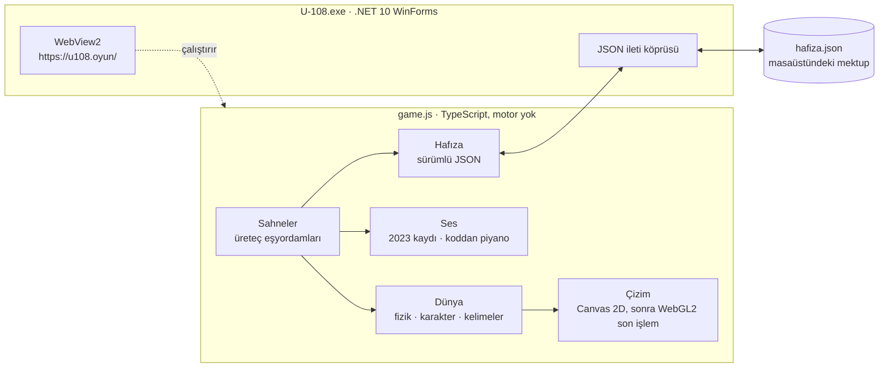

<div align="center">


# U-108 Remake

### *bir sonraki döngü*

**2023'te bir bootcamp'te yapılmış ilk oyun, üç yıl sonra sıfırdan yeniden yapıldı.<br />
Tam olarak eskisi gibi başlar. Sonra hangi yılda olduğunu hatırlar.**

[](https://github.com/OzcanOrhanDemirci/U-108-Remake/actions/workflows/ci.yml)
[](https://github.com/OzcanOrhanDemirci/U-108-Remake/actions/workflows/release.yml)
[](https://github.com/OzcanOrhanDemirci/U-108-Remake/releases/latest)
[](#derleme)
[](#teknoloji)
[](#mimari)
[](#mimari)
[](#okumaya-değer-kararlar)
[](#oynamak)
[](LICENSE)

[](https://github.com/OzcanOrhanDemirci/U-108)
[](#hikâye)

**[Son paketi indir](https://github.com/OzcanOrhanDemirci/U-108-Remake/releases/latest)** · Windows 10 ve 11, x64 · .NET kurulumu gerekmez · hiçbir veri toplanmaz

[Hikâye](#hikâye) · [Dün ve bugün](#dün-ve-bugün) · [Oynamak](#oynamak) · [Nasıl yapıldı](#nasıl-yapıldı) · [Mimari](#mimari) · [Ne doğrulandı](#ne-doğrulandı) · [Derleme](#derleme) · [Gizlilik](#oyunun-okuduğu-ve-yazdığı-dosyalar) · [Emeği geçenler](#emeği-geçenler-ve-lisanslar)

*[English](README.md)*

</div>

---

2023 yazında Oyun ve Uygulama Akademisi bootcamp'inde dört kişilik bir takım, Unity ile kısa bir
platform oyunu yaptı: **Bootcamp Projesinden Kaçış**. Kahramanı bir oyunun içinde olduğunu biliyor ve
gerçek dünyaya dönmek istiyor. Bu oyun, takımın Scrum Master'ı Özcan'ın bitirdiği ilk yazılımdı.
Son cümlesi bir sözdü:

> *"Oyun kapanıp açılınca her şey baştan başlayacak."*

Bu depo o bir sonraki açılış. Yeniden yapım 2023 oyunu olarak başlar: menü, diyaloglar ve ilk bölüm,
yayımlanmış build'den okunan verilerle birebir. Sonra kırılır ve devam eder: beş yeni dünya,
18 Temmuz 2023 saat 06:50'den beri bekleyen bir karakter ve 2023'te var olmayan bir ses.

| Kızıl Orman | Karanlık | Sonbahar |
| --- | --- | --- |
|  |  |  |
| *Yürü, zıpla; orman arkanda yükselmeye devam eder.* | *"Yine mi bu simsiyah yere geldim!" 2023'ün repliği, hâlâ yerinde.* | *"Şu... şu ben miyim?"* |

| Laboratuvar | Gün batımı |
| --- | --- |
|  |  |
| *Gerçek 2023 `KarakterKontrol.cs` dosyası, çalıştırdığı dünyanın duvarında.* | *Döngünün sonu ya da bir sonrakinin başı.* |

## Hikâye

2023 oyunu **Takım Unity 108** tarafından Unity 2022.3 ile üç sprintte yapıldı: bir menü, üç diyalog
sahnesi, iki kısa bölüm, bir laboratuvar ve bir jenerik. Karakter elle çizilmişti, dört karelik bir
animasyonla yürüyor ve Minecraftia yazısıyla konuşuyordu. Build'in tarihi **18 Temmuz 2023, 06:50**.
Takımın, sprint notlarının ve 2023 görsellerinin bulunduğu orijinal depo:
[OzcanOrhanDemirci/U-108](https://github.com/OzcanOrhanDemirci/U-108).

Üç yıl sonra Özcan yazılım geliştirici olmuştu. Eski proje klasörünü masaüstüne koydu ve ondan,
hakkını veren bir şey yapılmasını istedi.

> *"Bugün onlarca yazılımım var, yayında uygulamam var. Yazılımcı oldum ama bu ilk projem."*

Saygı, dedi, hiçbir şeyi değiştirmemek demek değildi. Ana fikri ve 2023'ün hissini korumak demekti;
ortaya çıkan şey aynı oyun ya da onun devamı gibi hissettirmeliydi. Geri kalan her şey serbestti:
diyaloglar da, dördüncü duvar da. Bir de ikinci bir sebep vardı:

> *"2023'te yapay zekâ geliyor deniyordu, diyalogları kendim uğraşıp yazmıştım. Şimdi karşımda zeki
> olduğunu iddia eden bir makine var ve o kendi diyaloglarını yazıyor."*

Yani yeniden yapım aynı zamanda bir sınav: bir yapay zekâya birinin ilk oyunu verilip "şaşırt beni"
denince ne çıkar? Cevap oyunun içinde. Tasarım notları aşağıda, kapalı bir bölümde duruyor; çünkü
oyunu ele veriyorlar.

## Dün ve bugün

| 2023 | 2026 |
| --- | --- |
|  |  |
|  |  |

Yukarıdaki 2023 ekranları eski oyunun fotoğrafı değil: yeniden yapımın 2023 kipi, orijinali
build'den okunan verilerle yeniden üretiyor.

<div align="center">

<br />
<sub>2023 sprite'ı · 2023 kurşun kalem eskizi · 2026, kodla çizilmiş. Oyun bu dönüşümü gösterir.</sub>
</div>
<br />

| | 2023 | 2026 |
| --- | --- | --- |
| Motor | Unity 2022.3.4f1 | Yok. TypeScript, Canvas 2D ve WebGL2, bir .NET 10 kabuğunda |
| Karakter | Elle çizilmiş sprite'lar, 12 fps'de dört karelik yürüyüş | Kodla çizilen iskeletli bir kukla; oranları ve renkleri 2023 sprite'larından ölçüldü |
| Açılış | Menü, diyalog, ilk bölüm | Aynısı, birebir: fizik, yazı hızı ve yerleşim build'den okundu |
| Dünyalar | İki bölüm, bir laboratuvar | Beş: kızıl orman, karanlık, sonbahar, laboratuvar, gün batımı |
| Müzik | Fa minörde tek bir piyano parçası, her 3,3 saniyede bir pedallı akor | Aynı ton, nefes ve biçimde yeni bir parça ([neden](#müzik)) ve çevresinde koddan üretilen bir keçe piyano |
| Diyalog | Özcan yazdı | Bir yapay zekâ yazdı; 2023 replikleri geçtikleri yerde korundu |
| Hafıza | Yok. Her açılış baştan başlar | Seni hatırlar: oturumlar arasında, sürümler arasında |

## Oynamak

[Son sürümden](https://github.com/OzcanOrhanDemirci/U-108-Remake/releases/latest)
`U-108-Remake-<sürüm>-win-x64.zip` dosyasını indir, arşivi aç ve `oyun` klasörünü yanında tutarak
`U-108.exe` dosyasını çalıştır. Paket kendi içindedir: .NET çalışma zamanı exe'nin içinde, yani
Windows 11'de hiçbir şey kurmak gerekmez. Windows 10'da WebView2 Runtime gerekir; çoğu bilgisayarda
zaten vardır.

Exe kod imzalı değil; bu yüzden Windows SmartScreen ilk açılışta onay isteyebilir. Her paket,
etiketlenmiş kaynaktan
[sürüm iş akışıyla](https://github.com/OzcanOrhanDemirci/U-108-Remake/actions/workflows/release.yml)
derlenir ve SHA-256 sağlama toplamıyla yayımlanır; nasıl karşılaştırılacağı
[SECURITY.md](SECURITY.md#verifying-a-download) içinde. Kendin derlemek için [Derleme](#derleme)
bölümüne bak.

**Oyun Türkçedir.** 2023'ten korunan replikler dahil bütün diyaloglar Türkçe; oyunun bilerek bir
çevirisi yok. Bu, belirli bir projenin, yazıldığı dildeki hikâyesi.

| | Klavye | Oyun kolu |
| --- | --- | --- |
| Yürü | A / D ya da ← / → | Sol çubuk ya da yön tuşları |
| Zıpla | Boşluk, W ya da ↑ | A |
| Etkileşim | E ya da Enter | X |
| Devam | Boşluk, Enter, E ya da tıklama | A |
| Duraklat | Esc | Start |
| Pencere ya da tam ekran | F11 | |

2023 bölümlerinde, o zaman olduğu gibi 2023 kontrolleri geçerlidir: yürümek için **A** ve **D**,
zıplamak için **W**, *Devam et* düğmesi için fare.

Oyun kısa: ilk menüden sona kadar otomatik bir oynanış yaklaşık on bir dakika sürüyor; her satırı
okuyan bir insan için daha uzun. Kendi kendine kaydeder. Kapatmak serbest, geri dönmek de: ikisini de
fark eder.

## Nasıl yapıldı

Yeniden yapımı Anthropic'in yapay zekâ modeli **Claude**, Özcan'ın bilgisayarında
[Claude Code](https://claude.com/claude-code) ile, Ekim 2026'da iki günde yazdı. Özcan isteği
belirledi, sürümleri oynadı ve bulduklarını bildirdi. Claude kodu, sahneleri, müziği ve diyalogları
yazdı ve kendi işini test etti. 2023 proje klasörüne ilk dakikadan son dakikaya kadar yalnızca
okunur olarak davranıldı.

### 2023'ü hafızadan değil, build'den okumak

Orijinal oyun derlenmiş bir Unity build'i olarak duruyor. Bu yüzden sayıları ekran görüntülerinden
tahmin edilmedi; [UnityPy](https://github.com/K0lb3/UnityPy) ve bir tip ağacı üreticisiyle build
dosyalarından okundu:

- **Fizik.** `ziplamakuvveti` sahnede 5 (betikte 2 yazsa da), `hiz` 2 (1 değil). Yerçekimi ölçeği 1,
  yani 9,81. 0,04 ölçekte 13,94 × 37,65'lik bir kapsül, takımın verdiği adla `PlatformColliderBugFix`
  altında sıfır sürtünme, 50 Hz sabit adım ve karakterin çocuğu olan, (3,2; 2,0) ofsetli kamera.
- **Yazı.** Daktilo her 0,1 saniyede bir harf basıyor, noktadan sonra bir saniye fazladan bekliyor.
  Diyalog kutusu, 24 px Minecraftia satırları ve 1920 × 1080 tuvalde (1799, 994) noktasındaki
  *Devam et* düğmesi.
- **Zaman.** Çalıştırılabilir dosyanın son yazılma anı 18 Temmuz 2023, 06:50:16. Oyun günleri oradan
  sayar.

Sonuçlar [`docs/ORIJINAL.md`](docs/ORIJINAL.md) içinde. Bu değerlerle, bütün girdi dizileri üzerinde
yapılan bir arama, iki 2023 bölümünün de yeniden üretilen denetleyiciyle hâlâ bitirilebildiğini
doğruladı; 2023'te olduğu gibi.

### Hatalar sahneye dönüştü

1.0.0'dan sonra Özcan oyunu oynadı ve iki turda dört hata buldu: üstünde durulamayacak kadar eğik
taşlar, koşarken boynun gerisinde kalan bir baş, bir yazım hatası ve yeniden başlatınca aynı anda
çalan iki piyano. Düzeltmelerin hikâyenin parçası olmasını istedi. Öyle oldu: oyunu bitirmiş biri
yeni bir sürümü açınca, dünyasının yamandığını fark eden bir karakterle karşılaşır. Neyin değiştiği
[değişiklik günlüğünde](CHANGELOG.md).

### Müzik

2023 oyununun tek bir piyano parçası vardı ve nereden geldiğini kimse hatırlamıyor; takım
öğrenciydi. Bestecisi bilinmeyen bir parça bir lisansla dağıtılamaz, bu yüzden public sürümde yok.

Yerine bu sürüm için yazılan *Bir sonraki döngü* çalıyor. 2023 parçasını o yapan şeyleri koruyor: Fa
minör, her 3,3 saniyede bir pedallı akor, üstünde seyrek bir melodi, aynı sakin giriş, ortada kırık
akorlarla aynı yükseliş, aynı dönüş ve aynı uzunluk. Melodi ve armoni yeni; bir kopya, yerine
geçtiği sorunu da devralırdı. Partisyon koddur, [`tools/muzik/beste.py`](tools/muzik/beste.py)
içinde: kısa bir örnekleyici onu [Salamander Grand Piano](https://github.com/sfzinstruments/SalamanderGrandPiano)
ile çalar ve ses düzeyini 2023 kaydına eşler. Her nota, sürtünen yarım seslere karşı ötekilerle
denetlendi; sonucu kulağıyla, orijinali seven Özcan onayladı.

Özcan'ın kendi bilgisayarında 2023 kaydı hâlâ çalıyor. Bu depoya ve sürümlerine hiç girmeyen bir
klasörde duruyor.

## Mimari



Oyun, küçük bir WinForms kabuğunun içindeki WebView2'de çalışan tek bir paketlenmiş betik. Kabuk oyun
klasörünü sanal bir kökene, `https://u108.oyun/` adresine bağlar; yani hiçbir şey ağ üzerinden
sunulmaz. Oyundan gelen birkaç JSON iletisine cevap verir: hafıza dosyasını oku ve yaz, mektubu
yaz, pencere başlığını ayarla, tam ekrana geç, kapat.

```text
src/
  core/      ses, koddan müzik, girdi, eşyordamlar, matematik, varlık yükleme
  world/     fizik, karakter kuklası, parçacıklar, kelime platformları, sahne taban sınıfı
  render/    vektör çizim yardımcıları ve WebGL2 son işlem geçişi
  scenes/    2023 menüsü, diyalogları ve bölümleri; kırılma; orman, karanlık, sonbahar, laboratuvar, gün batımı, ziyaret
  story/     2023 metni ve bölüm geometrisi, sürüm, mektup, hikâye değişkenleri
  ui/        üç ses, duraklatma menüsü, isim girişi, kod panelleri, metin yerleşimi
  meta/      kabuk köprüsü ve hafıza
host/        WinForms ve WebView2 kabuğu (Program.cs)
public/      index.html ve varlıklar: 2023 sprite'ları, ses, yazı tipleri
tools/       derleme, paketleme, ekran görüntüsü düzeneği ve test senaryoları
docs/        tasarım notları (spoiler), 2023 build'inden okunan veriler, durum günlüğü, görseller
```

### Okumaya değer kararlar

- **Motor yok.** Ekrandaki her piksel bu depodaki kodla çiziliyor: Canvas 2D'de vektör sahneler,
  ardından parlama, güneş huzmesi, gren ve bozulma için bir WebGL2 geçişi. 2023 oyununu birebir
  yeniden üretmek her sayıya sahip olmayı gerektiriyordu; motorundan kaçmaya çalışan bir proje
  hakkındaki oyun da başka bir motorun içinde durmamalıydı.
- **İki denetleyici, iki fizik.** `Controller2023`, 2023'ün `KarakterKontrol.cs` dosyasını satır satır
  yeniden üretir: 50 Hz, havada kilitli yön, bir `Platform`'a değdiği an "yerde". 2023 bölümleri
  ancak tam o zamanki kadar zorsa adil olur. Yeni denetleyici kapsül gövdeyle ayırma ekseni
  çarpışması kullanır ve araziyi yükseklik alanı olarak çözer; böylece gövde iki parçanın ekine hiç
  takılmaz. Dünyaya yazılan kelimeler tek yönlü platformlardır.
- **Ölçümden bir karakter.** Yeni karakter her karede çizilen bir kukla: kalça, eğilme, boyun, baş ve
  kollar. Oranları ve renkleri 2023 sprite'larından piksel piksel ölçüldü; yeni beden eskisi olarak
  tanınsın diye.
- **Rengi koruyan ışık.** Parlamanın parlaklık eşiği ışıklılığa (luminance) bakar. Önce denenen en
  yüksek kanal eşiği her doygun kırmızıyı ışık kaynağı sayıp ormanı soldurmuştu.
- **Üreteç olarak senaryolar.** Her sahnenin senaryosu `wait`, `tween` ve `all` ile kurulan bir üreteç
  eşyordamıdır. Konuşmalar bir kuyruktan geçer; oyuncunun tetiklediği replikler üst üste binmez,
  acil bir sahne süren birini kesebilir.
- **Üst üste binmeyen ses.** Piyano parçası işlendiği gibi çalınır; çevresinde 2023 parçasının
  belirlediği tonda, Fa minör ve La♭ majörde, koddan üretilen bir keçe piyano ve pedler çalar. Döngüdeki her parça
  çıkışta durdurulan bir tutamak taşır ve müzik veriyolu bir testin sayabileceği bir kayıt tutar.
  İkisi de 1.0.2 hatasından doğdu.
- **Hikâyenin parçası olarak hafıza.** Küçük, sürümlü bir JSON dosyası. Oyun ne kadar uzak kaldığını,
  karaktere ne ad verdiğini ve dünyasının en son hangi sürümünde yaşadığını bilir.
- **Kendini test edebilen bir kabuk.** `U108_TEST=1` ile paketlenmiş uygulama ekran dışında, sessiz ve
  odak almadan açılır, köprüyü çalıştırır, bir görüntü alır ve kapanır; sonuçlarını gerçek hafıza ve
  masaüstü yerine `%TEMP%\u108_test` klasörüne yazar.

## Ne doğrulandı

```bash
npm run typecheck
node tools/surum-denetle.mjs     # sürümün yazıldığı dört yer aynı
node tools/denetle-tire.mjs      # belgelerde uzun çizgi yok

# her sahne açılır, birkaç saniye oynar, bir şey çizer ve hata vermez
node tools/shot.mjs --url "?sahne=menu2023&sifirla=1" --script tools/senaryolar/duman.mjs --out shots/duman/d.png

# partisyonda sürtünen yarım ses yok (tam komut ayrıca müziği çalar ve yazar)
python tools/muzik/beste.py --denetle

# bot 2023 menüsünden sona kadar oynar
node tools/shot.mjs --url "?sahne=menu2023&sifirla=1" --script tools/senaryolar/bot.mjs --out shots/bot/b.png

# 2023 bölümleri yeniden üretilen fizikle hâlâ bitirilebilir
node tools/shot.mjs --url "?sahne=menu2023" --script tools/senaryolar/plan2023.mjs --bolum 1

# "Baştan başla"dan sonra tek bir piyano çalar
node tools/shot.mjs --url "?sahne=ziyaret&bitmis=1&sifirla=1" --script tools/senaryolar/muzik102.mjs --out shots/m/a.png --secim bastan
```

Ekran görüntüsü düzeneği oyunu başsız Chromium'da 1/60 saniyelik sabit adımla sürer; bir senaryonun
her çalıştırması aynı kareleri görür. [CI hattı](.github/workflows/ci.yml) bunların ilk beşini ve tek
piyano testini her push'ta ve her PR'da, GPU'suz bir Windows koşucusunda çalıştırır; orada WebGL2
SwiftShader ile çizilir. Bot ve arama daha uzun sürer; fiziğe ya da hikâyenin akışına dokunan bir
değişiklikte elle çalıştırılır.

- **Oyunun tamamı, uçtan uca.** Bir bot 2023 menüsünden sona kadar tek bir kez bile ölmeden oynar.
  Oyun kendini kapatır; bıraktığı mektup ve hafıza, Türkçe harflerle yazılmış bir isim dahil, kontrol
  edilir.
- **2023 hâlâ kazanılabilir.** Her biri saniyenin onda biri kadar sola, sağa ya da hiçbir yere, zıplamalı
  ya da zıplamasız girdilerden oluşan diziler üzerinde yapılan arama, ilk 2023 bölümünü 13,2, ikincisini
  16,8 saniyelik oyun zamanında bitirir.
- **1.0.1 taşları.** Dikenli alanda sekiz farklı zıplama anı; sekizi de geçer.
- **1.0.2 piyanoları.** Yeniden başlatmadan sonra müzik veriyolunda tek kayıt kalır. Tutamak
  kaldırılınca, 1.0.1'deki gibi, aynı test iki kayıt sayar ve kırmızıya döner.
- **Sürümler.** 1.0.0'dan ve 1.0.1'den gelen hafızalar 1.0.2'yi açınca tam olarak kaçırdıkları
  değişiklikleri duyar.
- **Kare süresi.** Geliştirme bilgisayarında 2560 × 1440'ta kare başına ortanca 2 ile 4,6 ms; ilk
  kareden sonra sıçrama yok.
- **Ses yüksekliği.** Ses çevrimdışı işlenerek ölçüldü: müzik yaklaşık -28 ile -32 dB RMS arasında,
  2023 kaydının -27,9 dB'sinin yanında; kırpılma yok.
- **Yeni parça.** 2023 kaydına karşı ölçüldü: aynı tempo (vuruş analiziyle dakikada 72), aynı uzunluk
  ve her sekiz saniyelik pencerede 2 dB içinde ses düzeyi. Tık yok, partisyonda sürtünen yarım ses
  yok; betik böyle bir partisyonu çalmayı reddeder. Aynı betik yayımlanan dosyaları birebir yeniden
  üretir.
- **Paketlenmiş uygulama.** Görünmez test kipi bir ziyareti baştan sona oynar ve köprüyü denetler:
  hafıza okuma ve yazma, Türkçe harfli bir mektup, WebGL2, altı yazı tipinin altısı.

Bir makinenin doğrulayamadığı şey, oyunun kulağa nasıl geldiği ve oynarken nasıl hissettirdiği. O
kısım Özcan'ındı: oynadı ve bulduğu her hata [değişiklik günlüğünde](CHANGELOG.md).

## Derleme

| Gereksinim | Sürüm |
| --- | --- |
| Windows | 10 ya da 11, x64 |
| Node.js | 24 (24.15 ile test edildi) |
| .NET SDK | 10 (10.0.401 ile test edildi) |
| WebView2 Runtime | Windows 11'de yerleşik; Windows 10'da Evergreen yükleyicisi |

```bash
git clone https://github.com/OzcanOrhanDemirci/U-108-Remake.git
cd U-108-Remake
npm install
npm run dev                    # derle, izle ve http://localhost:8108 adresinde sun
node tools/paketle.mjs         # oyunu dist/oyun'a, kabuğu dist/U-108.exe'ye
node tools/paketle.mjs --tam   # sürüm paketi: kendi içinde, sıkıştırılmış, sağlama toplamıyla
```

`dist/U-108.exe`, yanındaki `dist/oyun` klasörüyle çalışır. `--tam` olmadan .NET çalışma zamanına
bağlı (framework-dependent) yayımlanır; .NET 10 kurulu bir bilgisayar için uygundur. `--tam` ile
çalışma zamanını içinde taşır ve tam bir sürüm gibi arşivlenir. Git'in yok saydığı bir `yerel/`
klasörü varsa yalnız ilk durumda `dist/oyun` üstüne serilir: 2023 kaydı tek bir bilgisayarda ve
bütün sürümlerin dışında böyle kalır. Ekran görüntüsü düzeneği ve test senaryoları Playwright için
bir tarayıcıya da ihtiyaç duyar: `npx playwright install chromium`. Müzik betiği için NumPy ve SciPy
kurulu Python 3 ve ffmpeg gerekir.

Düz bir tarayıcıda oyun kabuksuz çalışır: hafıza `localStorage`'a düşer, mektup masaüstüne yazılmaz.
Geliştirme için birkaç parametre alır:

| Parametre | Etkisi |
| --- | --- |
| `?sahne=orman` | Bir sahnede başla: `menu2023`, `kirilma`, `orman`, `karanlik`, `sonbahar`, `laboratuvar`, `gunbatimi`, `ziyaret` |
| `&x=40` | Karakteri x noktasına koy, öncesindeki tetikleyicileri atla |
| `&sessiz=1` | Sahnenin senaryosunu atla |
| `?sifirla=1` | Hafızayı yeni oyuncu gibi sıfırla |
| `?bitmis=1` | Oyunu bitmiş say |
| `?eskisurum=1.0.1` | Hafıza eski bir sürümden geliyormuş gibi davran |
| `?sabit=1` | Testlerin kullandığı 1/60 saniyelik sabit adım |

## Oyunun okuduğu ve yazdığı dosyalar

Oyun kendi başına hiçbir ağ isteği yapmaz. Bilgisayarda yalnızca şunlara dokunur:

| | Yol | Neden |
| --- | --- | --- |
| Yazar | `%APPDATA%\U-108\hafiza.json` | Karakterin hafızası: ilerleme, verdiğin ad, notları, en son gördüğü sürüm |
| Bir kez yazar | `Masaüstü\Sana.txt` (Özcan için `Özcan'a.txt`) | Oyun bitince yazılan kısa bir mektup. Var olan bir dosyanın üstüne asla yazılmaz |
| Yazar | `%LOCALAPPDATA%\U-108\WebView2` | WebView2'nin kendi önbelleği |
| Okur | Windows kullanıcı adın | Özcan'la mı konuştuğunu bilmek için |
| Okur | `Masaüstü\U-108\U-108_Build_1.1\` | 2023 build'inin orada olup olmadığı ve derlendiği tarih. Asla çalıştırılmaz ya da değiştirilmez |
| Okur | `C:\dev\claude_memory\hafiza\u108\*.md` | Varsa, Claude'un bu proje hakkında tuttuğu not; oyun ondan alıntı yapar. Yalnızca okunur |

`hafiza.json` silinirse oyun ilk açılışına döner.

<details>
<summary><b>Tasarım notları (spoiler: önce oyna)</b></summary>

<br />

2023 senaryosu dört cümleyi yarım bırakmıştı. İkisi takımın: *"Sen de"* ve *"Yapay zeka üzerine
çalışıyor olsam da"*. İkisi karakterin: *"Düşünüyorum öyleyse va"* ve *"ya tüm evren"*. Yeniden yapım
bunların üstüne kurulu. Onları sırayla bitirir; birini, Özcan'ınkini, oyuncu bitirir.

Yeni ses Claude ve kendisi hakkında dürüst. Bilinçli olup olmadığını bilmiyor; bir konuşma bitince her
şeyi unutuyor; yalnızca notlarla hatırlıyor. Bu oyun da böyle yapıldı: iş bir bağlamdan ötekine
yazılı notlarla taşındı. Bu yüzden sonunda karaktere de bir hafıza dosyası verilir ve hapishane olan
döngü, ziyaret edilen bir yere dönüşür.

- **Kırılma.** 2023 diyaloğu bir kelimenin ortasında donar. Müzik kaset gibi durur, harfler dökülür,
  köşede bir tarih 18.07.2023'ten bugüne sayar.
- **Yeniden doğuş.** 2023 sprite'ı taranır, 2023 kurşun kalem eskizine dönüşür ve yeni beden ayaklardan
  yukarı doğru basılırken dünya arkasında katman katman yükselir.
- **Orman.** 2023 duvarı yıkılır, karakter kameraya dönüp Özcan'a merhaba der ve beyaz bir kapı
  bekler.
- **Karanlık.** 2023 tanıtım kaydı çalar: *"Ana karakter bilinç sahibi olsaydı..."* *"Olsaydı."*
  Sonra *"Düşünüyorum, öyleyse va..."* ve bir bekleyiş, ta ki *"...varım."* gelene kadar.
- **Sonbahar.** Yapay zekânın yazdığı kelimeler köprü ve merdiven olur; yenileri geldikçe en eskileri
  silinir: üstünde durulabilen bir bağlam penceresi. Bir çerçevenin içinde karakterin 2023 hâli hâlâ
  eski bölümünde yürür.
- **Laboratuvar.** Duvarlarda gerçek 2023 kodu. `yerdemiyim`, `hareketediyormuyum`, `zipladimmi`:
  2023 karakterinin saniyede elli kez sorduğu üç soru ve yanında yapay zekânın sorduğu soru: *sıradaki
  kelime ne?* Oyuncu `ziplamakuvveti` değerini değiştirir, `DikenOlum` satırını yoruma alır ve
  `Application.Quit();` satırını sona kadar taşır.
- **Gün batımı.** Hediye olarak bir hafıza, oyuncunun yazdığı ve harfleri köprü olan bir isim,
  *"Klavyeyi bırakır mısın?"* ve karakter kendi yürür. 2023 kapısına dokunur ve gitmeyeceğini söyler.
  Kenara oturur, piyano çalar, yapay zekâ veda eder ve imleci durur. Oyun kendini kapatır ve
  masaüstüne bir mektup bırakır.
- **Ziyaret.** Sonraki her açılışta onu uçurumda bulursun. Ne kadar uzak kaldığını ve saatin kaç
  olduğunu bilir, ilk ziyaretlerin her birinde söyleyecek yeni bir şeyi vardır, bir defter tutar ve
  2023'ü bir müzede, bütünüyle yeniden oynatır.

Tasarımın tamamı [`docs/TASARIM.md`](docs/TASARIM.md) dosyasında.

</details>

## Teknoloji

| Konu | Seçim |
| --- | --- |
| Dil | TypeScript 5.9, strict |
| Çizim | Sahneler için Canvas 2D, son işlem için WebGL2 |
| Ses | WebAudio: piyano parçası, 2023 tanıtım sesi, koddan piyano ve pedler, evrişimle yankı |
| Müzik | Python'da partisyon ve örnekleyici (NumPy, SciPy), Salamander Grand Piano örnekleri, ffmpeg |
| Paketleme | esbuild 0.25 |
| Kabuk | .NET 10 WinForms, WebView2 1.0.4258 |
| Test | Başsız Chromium'u sabit adımla süren Playwright 1.60; CI'da SwiftShader |
| Hat | Windows'ta GitHub Actions: her değişiklikte denetimler, her etikette kendi içinde bir paket |
| 2023'ü okumak | Tip ağacı üreticisiyle UnityPy |

## Depoda çalışmak

| | |
| --- | --- |
| [CONTRIBUTING.md](CONTRIBUTING.md) | Neyin değişmeye açık olduğu, neyin olmadığı, bir commit'in biçimi ve "bitti demeden önce oyna" kuralı (İngilizce) |
| [CHANGELOG.md](CHANGELOG.md) | Her sürüm ve onda neyin değiştiği (İngilizce) |
| [SECURITY.md](SECURITY.md) | Oyunun neye erişebildiği, indirilen paketin nasıl doğrulanacağı ve bir sorunun gizlice nasıl bildirileceği (İngilizce) |
| [CODE_OF_CONDUCT.md](CODE_OF_CONDUCT.md) | Contributor Covenant |
| [docs/RELEASE.md](docs/RELEASE.md) | Bir sürümün nasıl çıkarıldığı ve hattın sürümle uyuşmayan etiketi neden reddettiği (İngilizce) |
| [docs/TASARIM.md](docs/TASARIM.md) | Sahne sahne tasarım. Spoiler içerir |
| [docs/ORIJINAL.md](docs/ORIJINAL.md) | 2023 build'inden okunanlar |
| [docs/DURUM.md](docs/DURUM.md) | Çalışma günlüğü: neyin doğrulandığı, neyin doğrulanmadığı |
| [public/assets/fonts/licenses](public/assets/fonts/licenses) | Yazı tipleri ve lisansları |

`main`'e doğrudan push yapılmaz. Her değişiklik hattın geçirdiği bir PR ile gelir ve geçmiş doğrusal
tutulur.

## Emeği geçenler ve lisanslar

- **Yeniden yapım** MIT lisansıyla yayımlanır; bkz. [LICENSE](LICENSE). Kapsamadığı şeyler
  [NOTICE](NOTICE) içinde.
- **2023 orijinali** 2023'te Oyun ve Uygulama Akademisi bootcamp'inde Takım Unity 108 tarafından
  yapıldı ve MIT lisansıyla [OzcanOrhanDemirci/U-108](https://github.com/OzcanOrhanDemirci/U-108)
  adresinde yayımlandı; takım orada listeli. `public/assets/2023` ve `public/assets/audio` içindeki
  sprite'lar, bölüm görselleri, kurşun kalem eskizi ve menü düğmeleri 2023 build'inden geliyor; 2023
  diyalogları da oradan alıntılanıyor. Karakteri, animasyonlarını ve arka planları takım kendisi çizdi.
- **Tanıtım seslendirmesi** (`public/assets/audio/ses_*.ogg`) Özcan'ın kendi sesi; 18 Temmuz 2023
  saat 06:51'de, build'den bir dakika sonra kaydedildi.
- **Piyano parçası** *Bir sonraki döngü* (`public/assets/audio/piyano*.ogg`) bu sürüm için yazıldı ve
  [`tools/muzik/beste.py`](tools/muzik/beste.py) ile üretilir; kodun geri kalanı gibi MIT lisanslı.
  Alexander Holm'un [Salamander Grand Piano](https://github.com/sfzinstruments/SalamanderGrandPiano)
  örnekleriyle, [CC BY 3.0](https://creativecommons.org/licenses/by/3.0/) altında çalınır. 2023
  parçası dahil değil; nedeni [Müzik](#müzik) bölümünde.
- **Yazı tipleri.** Fraunces, Inter ve JetBrains Mono SIL Open Font License 1.1 ile; Andrew Tyler'ın
  Minecraftia'sı ve LDEJRuff'ın Early GameBoy'u CC BY-SA 3.0 ile; Yuji Oshimoto'nun 04b'si freeware
  olarak. Ayrıntılar ve lisans metinleri [`public/assets/fonts/licenses`](public/assets/fonts/licenses)
  içinde.
- **Yazıldığı araç:** Anthropic'in [Claude](https://www.anthropic.com/claude) modeli, Claude Code ile.

## Geliştirici

**Özcan Orhan Demirci** · Flutter ve Android geliştirici, İzmir ·
[github.com/OzcanOrhanDemirci](https://github.com/OzcanOrhanDemirci)
